<div align="center">


# GitManager
### GitHub-Native Collaborative Project Management

[](https://react.dev)
[](https://vitejs.dev)
[](https://flask.palletsprojects.com)
[](https://sqlite.org)
[](https://python.org)
[](LICENSE)

<p>
  <a href="#-demo">View Demo</a> ·
  <a href="#-features">Features</a> ·
  <a href="#-getting-started">Quick Start</a> ·
  <a href="#-deployment">Deploy</a> ·
  <a href="#-contributing">Contribute</a>
</p>

</div>

---

## 🎯 What is GitManager?

**GitManager** is a full-stack, open-source project management platform built specifically for developer teams. It bridges the gap between task tracking and version control by integrating directly with your GitHub repositories — syncing issues, pull requests, and commits in real time.

Whether you're a solo developer or a team of 10, GitManager gives you everything you need to plan, build, and ship — all in one beautifully designed, dark-themed interface.

---

## 📸 Screenshots

<div align="center">

### 🔐 Login Page
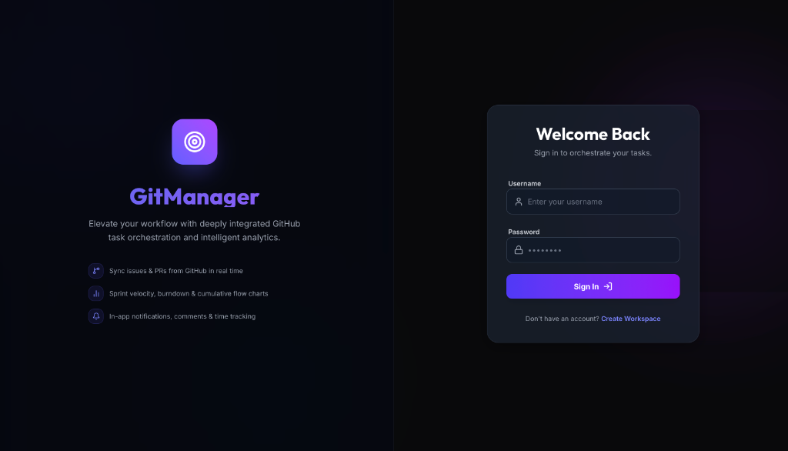
> Split-panel — GitManager branding & feature list on the left, clean sign-in form on the right.

---

### 📊 Dashboard — Your Projects
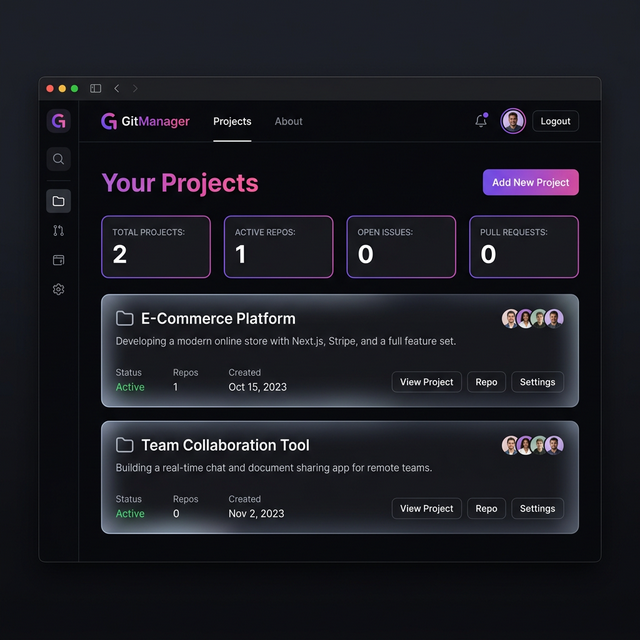
> Gradient "Your Projects" heading, search bar, and **+ New Project** quick-action button.

---

### ➕ Create Project Modal
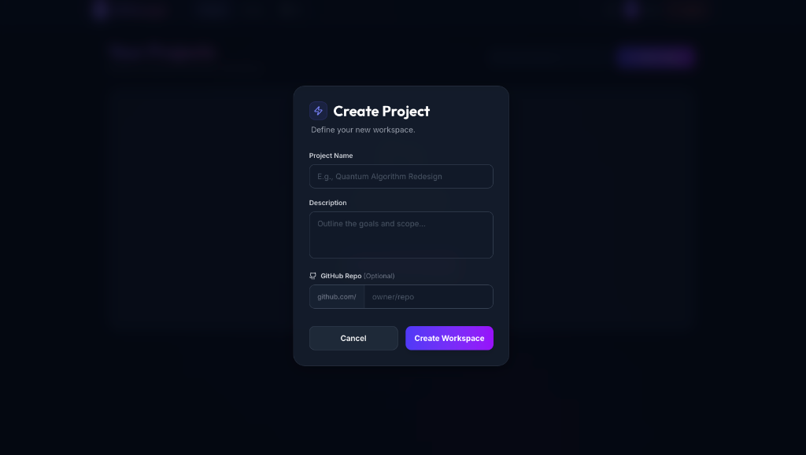
> Dark modal with Project Name, Description, and optional GitHub Repo (`owner/repo`) fields.

---

### 🗂️ Kanban Board
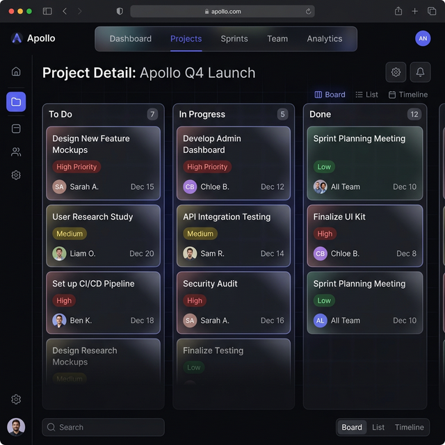
> Three columns — **To Do / In Progress / Done** — with task cards, priority badges (Medium / High), START / FINISH / REOPEN actions, Recent Commits feed, and Open Pull Requests panel.

---

### 📈 Analytics
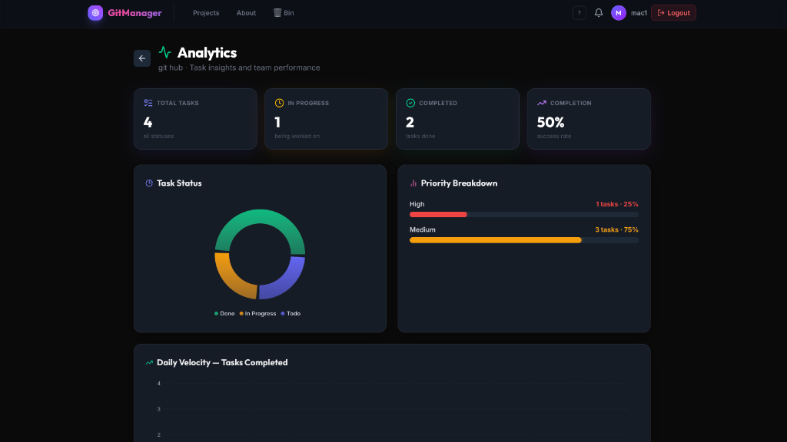
> Stat cards (Total Tasks, In Progress, Completed, Completion %), Task Status donut chart, Priority Breakdown bar chart, and Daily Velocity graph.

---

### 🏃 Activity Log
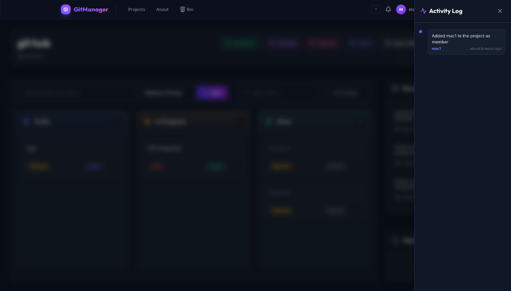
> Slide-in Activity Log drawer showing timestamped project events (member joins, task changes, etc.).

---

### 🚀 Iterations — Sprint Management
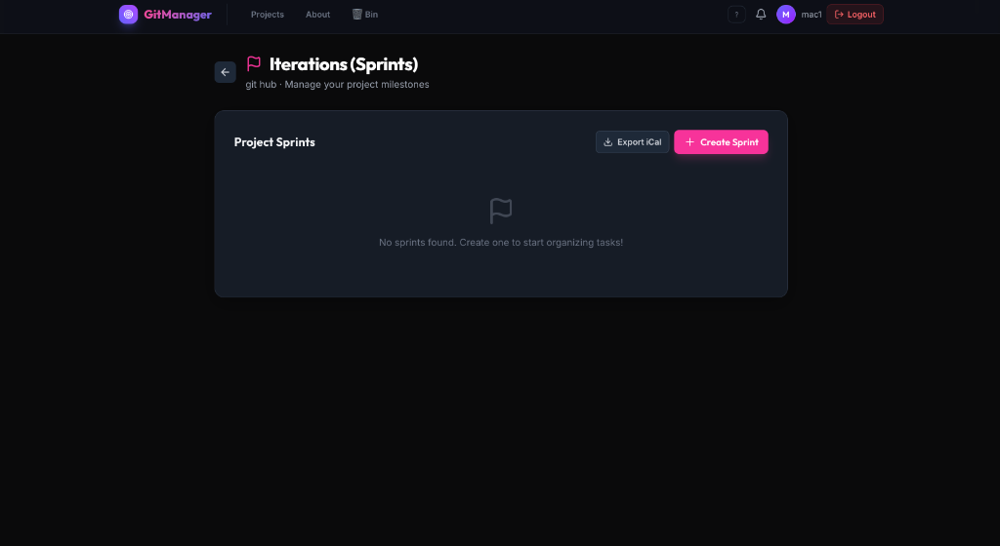
> Sprint listing page with **Export iCal** and **+ Create Sprint** actions.

---

### 📅 Create Sprint
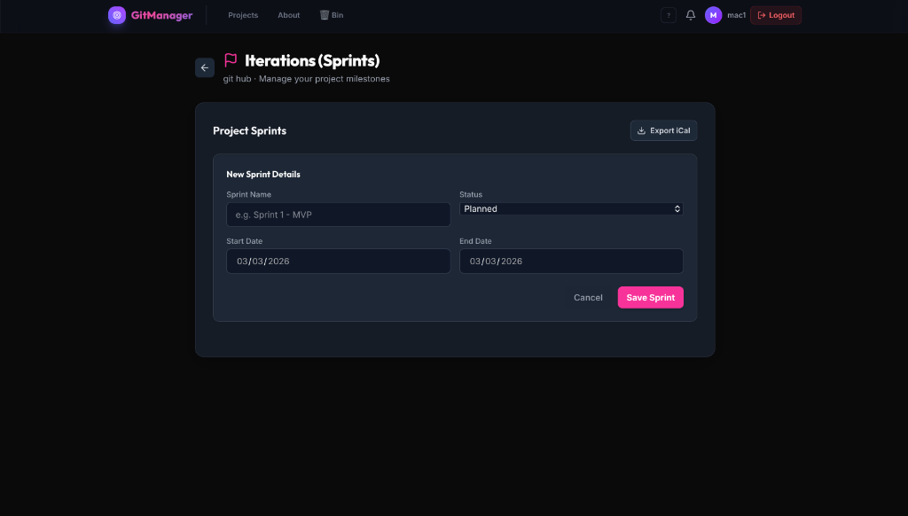
> Sprint creation form — Sprint Name, Status (Planned / Active / Completed), Start & End dates.

---

### 👥 Team Settings
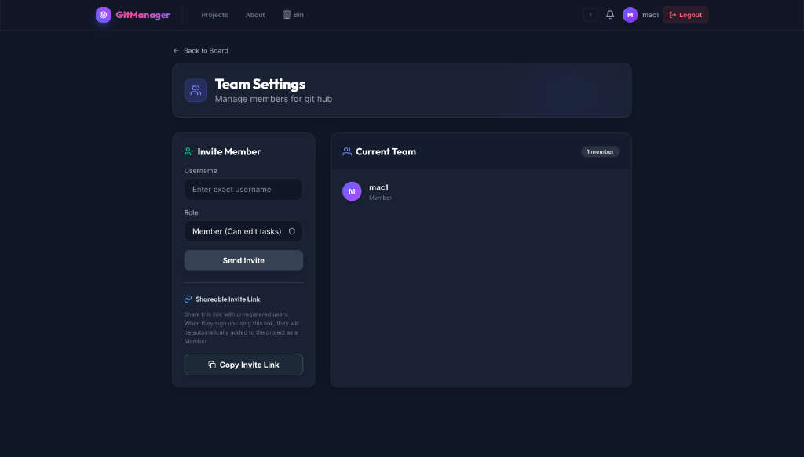
> Invite members by username, assign roles (Member / Admin), and share a **Shareable Invite Link** for unregistered users. Current team roster shown on the right.

---

### 🗑️ Recycle Bin
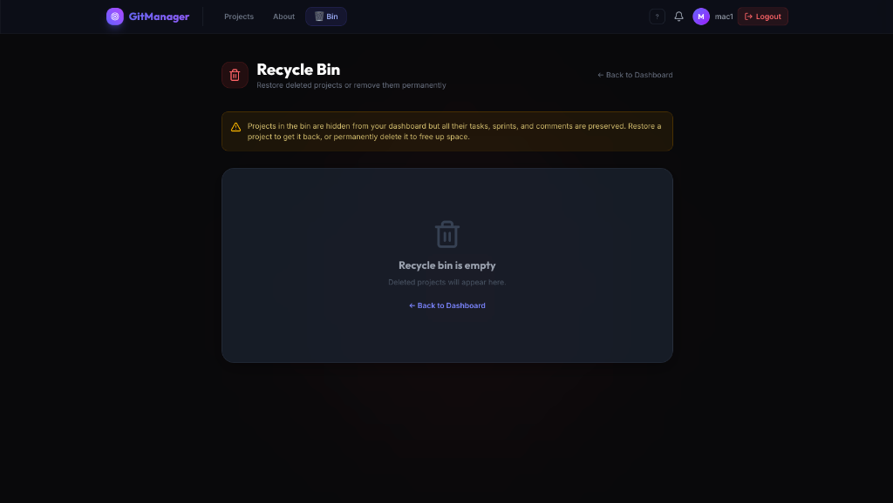
> Soft-deleted projects appear here with a **Restore** button and a two-step **Delete Forever** confirmation. All tasks and sprints are preserved until permanently deleted.

---

### ℹ️ About
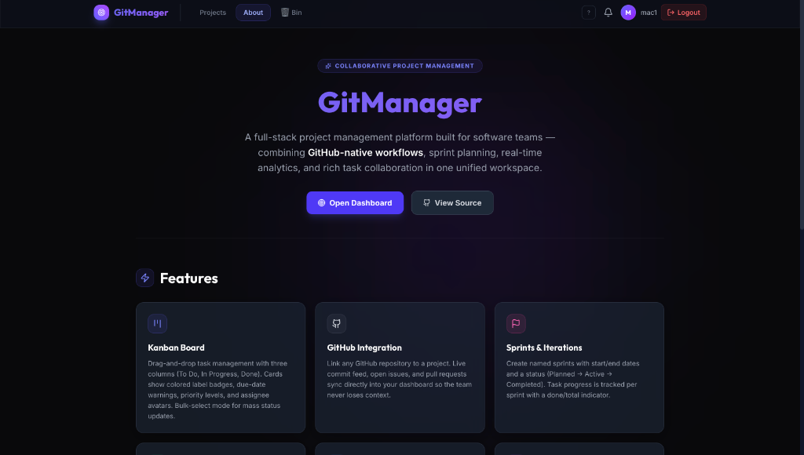
> About page with app description, feature cards (Kanban Board, GitHub Integration, Sprints & Iterations), and links to the Dashboard and source code.

</div>

---

## ✨ Features

<table>
<tr>
<td width="50%">

### 🐙 GitHub Integration
- Live sync of issues and pull requests
- Real-time commit feed from linked repos
- Automatic repo statistics display on project cards

### 📋 Kanban Boards
- Drag-and-drop tasks between columns
- **To Do → In Progress → Done** workflow
- Click any task to open the full detail modal

### 📊 Analytics & Sprints
- Sprint velocity charts (Recharts)
- Burndown and cumulative flow diagrams
- Task priority & status distribution

### 👥 Team Collaboration
- Invite members via shareable links
- Role-based access (Owner / Admin / Member)
- Works for unregistered users via invite URL

</td>
<td width="50%">

### ⏱️ Time Tracker & Stopwatch
- Live `HH:MM:SS` stopwatch per task
- Colour-coded timer (green → amber → red)
- Manual time entry + full session history

### 📎 File Attachments
- Drag-and-drop file uploads per task
- Inline download & delete
- Icons auto-picked by file extension

### 🗑️ Recycle Bin
- Soft-delete projects (no data loss)
- Restore with one click
- Permanent delete with confirmation

### 🔔 Notifications
- In-app notification bell with badge
- Real-time alerts for task assignments & mentions
- Mark all as read / dismiss individual

</td>
</tr>
</table>

### Additional Features
- 🔐 **JWT Authentication** — secure login & register with token-based sessions
- 🏷️ **Labels** — create coloured labels and tag tasks
- 📅 **Due Dates** — set and track task deadlines
- 👤 **Profile Page** — task history, activity log, account management
- 🔗 **About Page** — app overview with animated feature cards
- 📱 **Responsive Design** — works on desktop, tablet, and mobile
- ✨ **Premium UI** — glassmorphism, animated mesh grid, gradient text, Framer Motion

---

## 🛠️ Tech Stack

### Frontend
| Technology | Purpose |
|---|---|
| **React 18** | UI component framework |
| **Vite** | Build tool & dev server |
| **Tailwind CSS v4** | Utility-first styling |
| **Framer Motion** | Animations & transitions |
| **@hello-pangea/dnd** | Drag-and-drop Kanban |
| **Recharts** | Analytics charts |
| **Lucide React** | Icon set |
| **date-fns** | Date formatting |
| **Axios** | HTTP client |

### Backend
| Technology | Purpose |
|---|---|
| **Python 3.9+** | Runtime |
| **Flask** | REST API framework |
| **SQLAlchemy** | ORM (Object-Relational Mapper) |
| **SQLite** | Embedded database |
| **PyJWT** | JWT authentication |
| **Flask-CORS** | Cross-Origin Resource Sharing |
| **Werkzeug** | Password hashing |

### External APIs
| API | Purpose |
|---|---|
| **GitHub REST API v3** | Commits, issues, pull requests |

---

## 📂 Project Structure

```
git-project-manager/
├── assets/                        # README screenshots
├── backend/                       # Flask REST API
│   ├── app.py                     # App entry point & CORS setup
│   ├── models.py                  # SQLAlchemy models
│   ├── requirements.txt           # Python dependencies
│   └── routes/
│       ├── auth.py                # Login / Register / JWT
│       ├── projects.py            # Project CRUD + soft delete
│       ├── tasks.py               # Task CRUD + Kanban
│       ├── sprints.py             # Sprint management
│       ├── analytics.py           # Charts & stats data
│       ├── github.py              # GitHub API proxy
│       ├── notifications.py       # In-app notifications
│       ├── time_tracking.py       # Stopwatch & time logs
│       ├── attachments.py         # File upload/download
│       ├── invites.py             # Team invite links
│       └── profile.py             # User profile & activity
│
└── frontend/                      # React + Vite SPA
    ├── index.html
    ├── package.json
    ├── vite.config.js
    └── src/
        ├── App.jsx                # Router & route guards
        ├── index.css              # Global styles & animations
        ├── animations.js          # Shared Framer Motion variants
        ├── pages/
        │   ├── Landing.jsx        # Public landing page
        │   ├── Login.jsx
        │   ├── Register.jsx
        │   ├── Dashboard.jsx      # Project list + stats
        │   ├── ProjectDetail.jsx  # Kanban board
        │   ├── Sprints.jsx
        │   ├── Analytics.jsx
        │   ├── TeamSettings.jsx
        │   ├── Profile.jsx
        │   ├── About.jsx
        │   └── RecycleBin.jsx
        └── components/
            ├── Navbar.jsx
            ├── TaskDetailModal.jsx
            ├── TimeTracker.jsx
            ├── FileAttachments.jsx
            ├── NotificationBell.jsx
            ├── LabelPicker.jsx
            └── PullRequestsWidget.jsx
```

---

## 🚀 Getting Started

### Prerequisites

- **Node.js** v18 or later
- **Python** 3.9 or later
- **Git**

### 1. Clone the Repository

```bash
git clone https://github.com/Shreemohanpalthya359/Collabarative-Project-Management-Tool-.git
cd Collabarative-Project-Management-Tool-
```

### 2. Setup the Backend

```bash
cd backend

# Create and activate virtual environment
python3 -m venv venv
source venv/bin/activate        # macOS/Linux
# venv\Scripts\activate         # Windows

# Install dependencies
pip install -r requirements.txt

# Start the Flask server
python3 app.py
```

> ✅ The API will start at `http://127.0.0.1:5001`
> ✅ The SQLite database (`instance/project_manager.db`) auto-creates on first run

### 3. Setup the Frontend

Open a **new terminal**:

```bash
cd frontend

# Install dependencies
npm install

# Start the development server
npm run dev
```

> ✅ The app will be available at `http://localhost:5173`

### 4. Start Using the App

1. Visit `http://localhost:5173` — you'll see the **Landing Page**
2. Click **Get Started Free** and register an account
3. Create your first project from the **Dashboard**
4. Optionally link a GitHub repo (`owner/repo` format)
5. Add tasks and manage them on the **Kanban Board**
6. Invite teammates via the **Team Settings** page

---

## 🌐 Deployment

### Frontend → Vercel

```bash
# Install Vercel CLI
npm i -g vercel

cd frontend
vercel
```

Set environment variable in Vercel dashboard:
```
VITE_API_URL = https://your-backend.onrender.com/api
```

### Backend → Render

1. Install `gunicorn`: `pip install gunicorn && pip freeze > requirements.txt`
2. Create a new **Web Service** on [render.com](https://render.com)
3. Set **Root Directory** to `backend`
4. **Build command**: `pip install -r requirements.txt`
5. **Start command**: `gunicorn app:app`

> 💡 For persistent data, use Render's free **PostgreSQL** add-on and update `DATABASE_URL` in your Flask config.

---

## 🔑 Environment Variables

### Backend (`backend/.env`)

```env
SECRET_KEY=your-super-secret-jwt-key-at-least-32-chars
```

### Frontend (`frontend/.env`)

```env
VITE_API_URL=http://localhost:5001/api
```

---

## 🤝 Contributing

Contributions are what make the open-source community amazing! Any contributions you make are **greatly appreciated**.

1. Fork the repository
2. Create your feature branch: `git checkout -b feature/AmazingFeature`
3. Commit your changes: `git commit -m 'Add some AmazingFeature'`
4. Push to the branch: `git push origin feature/AmazingFeature`
5. Open a **Pull Request**

---

## 📋 Roadmap

- [ ] 🔴 Real-time collaboration via WebSockets
- [ ] 🟡 Dark/Light mode toggle
- [ ] 🟡 Email notifications
- [ ] 🟡 GitHub OAuth login
- [ ] 🟢 PostgreSQL support for production
- [ ] 🟢 Docker compose setup
- [ ] 🟢 Export to CSV / PDF

---

## 📄 License

Distributed under the **MIT License**. See `LICENSE` for more information.

---

## 👤 Author

**Shreemohan Palthya**

[](https://github.com/Shreemohanpalthya359)

---

<div align="center">

**⭐ If you found this project useful, please give it a star!**

Made with ❤️ for Developer Productivity

</div>
